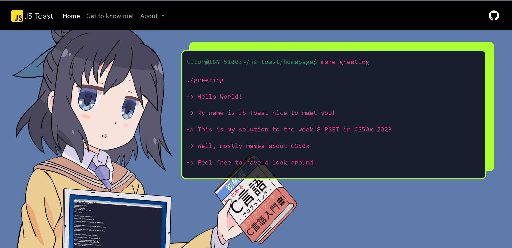
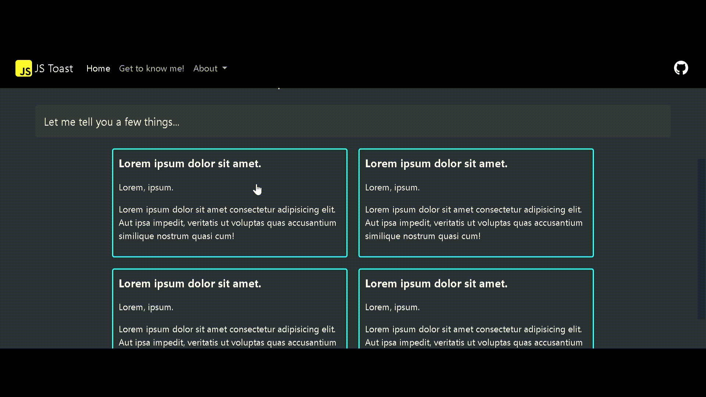

# Personal Homepage website for CS50x PSET 8



```sh
titor@IBN-5100:~/js-toast/homepage$ make greeting

./greeting

-> Hello World!

-> My name is JS-Toast nice to meet you!

-> This is my solution to the week 8 PSET in CS50x 2023

-> Well, mostly memes about CS50x

-> Feel free to have a look around!
```

I had so much fun making this website. I used
bootstrap v5.2 as it was a necessary part of the problem set however, a lot of the styling is my own `CSS`. This project would have not come out as nicely as I would have wished for it to be without some major inspiration and without the help of some assets and websites. Below I leave a link to the resources that helped me the most during development and to whatever inspired the layout of this page.

---

## Assets and images:

- [Wallpaper cave](https://wallpapercave.com/)
- [Unsplash](https://unsplash.com/wallpapers)
- [svgrepo](https://www.svgrepo.com/vectors/github/)

## Websites that inspired the landing page:

- [Hakurie shrine by Lyrenide](https://criosyom.github.io/Hakurei_Shrine/), [github](https://github.com/Criosyom/Hakurei_Shrine/tree/main)

- [w3schools](https://www.w3schools.com/)
- [bootstrap docs v5.2](https://getbootstrap.com/docs/5.2/getting-started/introduction/)
- [MDN](https://developer.mozilla.org/)
- [Smooth Transition color gradients](https://keithjgrant.com/posts/2017/07/transitioning-gradients/) (check it below)



And finally, thanks for the existence of lorem ipsum placeholder text. Wouldn't know what to do without it.
